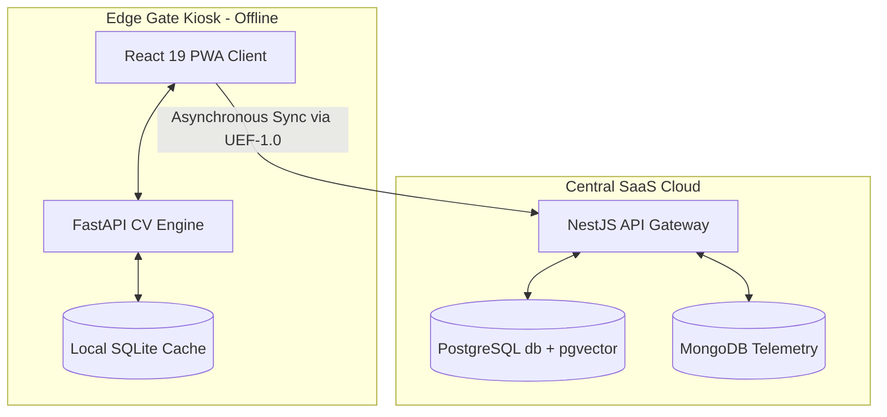

# 🛡️ FaceShield EdgeAI

<p align="center">
  
  
  
  
  
  
  
  
</p>

<p align="center">
  
  
  
</p>

> **"Zero Network. Zero Fraud. Instant Identity."**
> Developed for the **NHAI Innovation Hackathon 7.0** by **Arjun S N** & **Godfrey T R**.</

---

## 📋 Executive Summary & Vision

**FaceShield EdgeAI** is a highly accurate, lightweight, and entirely offline facial recognition, personal protective equipment (PPE) compliance, and passive liveness detection solution. Developed specifically for extreme environments and high-security zones, FaceShield EdgeAI is designed to integrate seamlessly into the existing **National Highways Authority of India (NHAI) Datalake 3.0** ecosystem.

By combining local edge-intelligence models with a multi-signal identity trust framework, FaceShield EdgeAI delivers zero-trust biometric authentication, incident monitoring, and automatic data reconciliation without relying on active internet connections or expensive cloud-based APIs.

---

## 🚀 Core Technical Innovations

1. **3-Signal Passive Liveness Engine**: A lightweight, CPU-optimized offline validation pipeline combining:
   - *Laplacian Texture Variance*: Analyzes face sharpness vs. flat photo blur.
   - *Specular Highlight Analysis*: Examines ambient light glares (expects $0.5\%$ to $8.0\%$ specular coverage) to identify matte printouts.
   - *HSV Skin-Tone Saturation Distribution*: Tracks color spreads to filter black-and-white printouts and digital replays.
2. **Decoupled Dual-Database Caching**: Mirrored PostgreSQL + pgvector primary DB database structure mapped onto a local, thread-safe SQLite cache ([fencein_cache.db](file:///d:/Faceshield/biometrics_service/fencein_cache.db)) for sub-millisecond, offline $1:N$ searches.
3. **OpenCV-Based PPE Compliance Auditing**: Executes real-time color range thresholding in HSV color space to verify safety gear (Helmets, Safety Vests, and Face Masks) before triggering the gate release.
4. **Composite Identity Trust Scoring**: Calculates a weighted multidimensional trust index:
   $$\text{Trust Score} = (\text{FaceMatch} \times 0.40) + (\text{Liveness} \times 0.25) + (\text{Geofence} \times 0.15) + (\text{Device} \times 0.10) + (\text{Behavior} \times 0.10)$$

---

## 🛠️ System Architecture

FaceShield EdgeAI implements a decentralized three-tier architecture:



### Data Flow Layout

- **Enrollment Flow**: User Photo $\rightarrow$ [NestJS Gateway](file:///d:/Faceshield/backend) $\rightarrow$ [pgvector Indexing (PostgreSQL)](file:///d:/Faceshield/backend/prisma/schema.prisma) $\rightarrow$ Sync Trigger $\rightarrow$ SQLite Local Mirror.
- **Verification Flow**: Camera Frame $\rightarrow$ UltraFace (ONNX detection) $\rightarrow$ Liveness Pipeline $\rightarrow$ ArcFace (ONNX 512D) $\rightarrow$ SQLite Cosine dot product (NumPy) $\rightarrow$ Gate Decision (Trust + PPE) $\rightarrow$ Event Queued $\rightarrow$ Service Worker syncs to Datalake 3.0.

---

## 📦 Technology Stack

| Layer | Technology | File / Module |
| :--- | :--- | :--- |
| **Frontend** | React 19, TypeScript, Vite, Tailwind CSS, Zustand | [/frontend](file:///d:/Faceshield/frontend) |
| **Backend Gateway** | NestJS, Prisma ORM, WebSockets, MongoDB, Passport | [/backend](file:///d:/Faceshield/backend) |
| **Biometrics API** | Python, FastAPI, Uvicorn, ONNX Runtime | [/biometrics_service](file:///d:/Faceshield/biometrics_service) |
| **Local Cache** | SQLite (`sqlite3`), NumPy, OpenCV | [offline_cache.py](file:///d:/Faceshield/biometrics_service/offline_cache.py) |
| **Security Layer** | Crypto (AES-256-CBC) for biometric template encryption | [schema.prisma](file:///d:/Faceshield/backend/prisma/schema.prisma) |
| **Databases** | PostgreSQL (`pgvector`), MongoDB (Analytics), SQLite (Edge) | [schema.prisma](file:///d:/Faceshield/backend/prisma/schema.prisma) |

---

## 💻 Local Setup & Developer Guide

The system includes a central console launcher script, [start.bat](file:///d:/Faceshield/start.bat), to bootstrap all local microservices.

### 📋 Prerequisites
- **Node.js** (v18+)
- **Python** (v3.9+) with virtual environment support
- **PostgreSQL** & **MongoDB** connections active (or credentials specified in env files)

### ⚙️ Environment Configurations
Create `.env` files in each service directory using the templates:
- Root environment variables: [.env](file:///d:/Faceshield/.env)
- Backend configuration: [backend/.env](file:///d:/Faceshield/backend/.env)
- Biometrics configuration: [biometrics_service/.env](file:///d:/Faceshield/biometrics_service/.env)

### ⚡ Running the Launcher
Simply execute the launcher batch file in your terminal:
```powershell
.\start.bat
```
Choose from the interactive menu:
- **`[1]` Boot Core Infrastructure**: Validates node modules, updates dependencies, runs Prisma database migrations, validates Cloudinary credentials, and spawns microservices on designated ports.
- **`[2]` System Override**: Stops active services and terminates all background processes running on ports `3456`, `8000`, `2345`, and `5566`.
- **`[3]` Exit**: Quits the launcher.

### 🌐 Default Routing Endpoints
Once the system boots successfully:
- **Client UI Dashboard**: [http://localhost:2345](http://localhost:2345)
- **API Gateway Gateway**: [http://localhost:3456/api/v1](http://localhost:3456/api/v1)
- **API Swagger Documentation**: [http://localhost:3456/api/docs](http://localhost:3456/api/docs)
- **Biometrics Health Engine**: [http://localhost:8000/api/biometrics/health](http://localhost:8000/api/biometrics/health)
- **Telemetry Security Logger**: Port `5566`

---

## ☁️ Deployment Guide

For details on cloud deployment to **Vercel** (Frontend), **Render** (Backend NestJS & Biometrics Python Service), and **Supabase** (PostgreSQL database with `pgvector`), please refer to the deployment manual:
- 📖 [Deployment Guide (guide.md)](file:///d:/Faceshield/guide.md)

---

## 🛡️ Key Safety & Security Features

- **Ghost Worker Prevention**: Checks face similarity against registered profiles ($1:N$). If similarity index $\ge 0.82$, registration is blocked to prevent duplicate contractors.
- **Biometric Template Protection**: Raw photos are never stored. Fingerprints are encrypted locally using AES-256-CBC, and face templates are kept as un-reversible 512-dimensional vector math hashes.
- **Geofence Enforcement**: Matches user coordinates via the Haversine formula against GPS coordinates and site boundaries defined in [schema.prisma](file:///d:/Faceshield/backend/prisma/schema.prisma).

---

## 👥 Meet the Team

- **Arjun S N** — *Team Leader & System Architect*
- **Godfrey T R** — *Team Member & System Developer*

---
*Zero Network. Zero Fraud. Instant Identity. Powered by FaceShield EdgeAI.*
