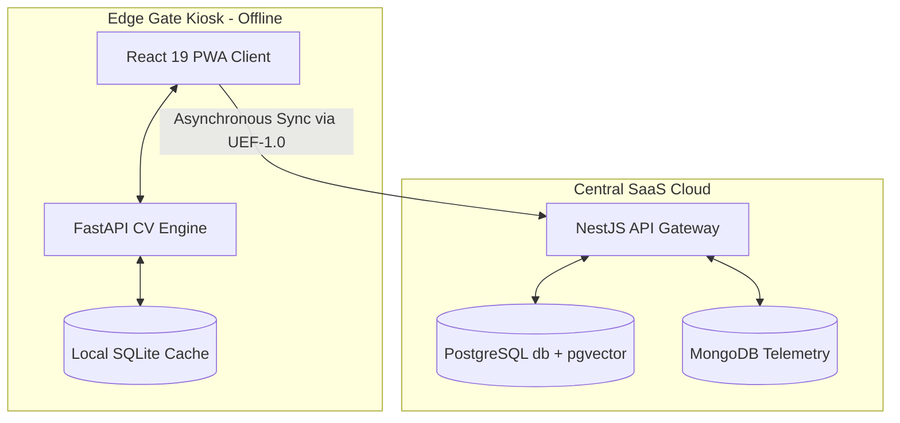

# 🛡️ FaceShield EdgeAI

<p align="center">
  
  
  
  
  
  
  
  
</p>

<p align="center">
  
  
  
  
</p>

> **"Zero Network. Zero Fraud. Instant Identity."**
> Developed for the **NHAI Innovation Hackathon 7.0** by **Arjun S N** & **Godfrey T R**.

---

## 📋 Executive Summary & Vision

**FaceShield EdgeAI** is a highly accurate, lightweight, and entirely offline facial recognition, personal protective equipment (PPE) compliance, and passive liveness detection solution. Developed specifically for extreme environments and high-security zones, FaceShield EdgeAI is designed to integrate seamlessly into the existing **National Highways Authority of India (NHAI) Datalake 3.0** ecosystem.

By combining local edge-intelligence models with a multi-signal identity trust framework, FaceShield EdgeAI delivers zero-trust biometric authentication, incident monitoring, and automatic data reconciliation without relying on active internet connections or expensive cloud-based APIs.

---

## 🚀 Core Technical Innovations

1. **3-Signal Passive Liveness Engine**: A lightweight, CPU-optimized offline validation pipeline combining:
   - *Laplacian Texture Variance*: Analyzes face sharpness vs. flat photo blur.
   - *Specular Highlight Analysis*: Examines ambient light glares (expects $0.5\%$ to $8.0\%$ specular coverage) to identify matte printouts.
   - *HSV Skin-Tone Saturation Distribution*: Tracks color spreads to filter black-and-white printouts and digital replays.
2. **Decoupled Dual-Database Caching**: Mirrored PostgreSQL + pgvector primary DB database structure mapped onto a local, thread-safe SQLite cache ([fencein_cache.db](./biometrics_service/fencein_cache.db)) for sub-millisecond, offline $1:N$ searches.
3. **OpenCV-Based PPE Compliance Auditing**: Executes real-time color range thresholding in HSV color space to verify safety gear (Helmets, Safety Vests, and Face Masks) before triggering the gate release.
4. **Composite Identity Trust Scoring**: Calculates a weighted multidimensional trust index:
    $$\text{Trust Score} = (\text{FaceMatch} \times 0.40) + (\text{Liveness} \times 0.25) + (\text{Geofence} \times 0.15) + (\text{Device} \times 0.10) + (\text{Behavior} \times 0.10)$$

---

## 🌟 Core System Features

We categorize the key features of **FaceShield EdgeAI** across its multi-service codebase:

### 🧠 1. AI-Powered Biometrics & Liveness
- **Real-Time Edge Face Detection**: CPU-optimized local inference using UltraFace ONNX session loaded within [face_auth.py](file:///d:/Faceshield/biometrics_service/face_auth.py).
- **ArcFace Feature Extraction**: Generates deep 512-dimensional normalized face keypoint embedding vectors in local memory inside [face_auth.py](file:///d:/Faceshield/biometrics_service/face_auth.py).
- **3-Signal Passive Liveness Engine**: Implements a lightweight validation pipeline combining Laplacian Texture Variance, Specular Highlight Analysis, and HSV Skin-Tone Saturation Distribution inside [face_auth.py](file:///d:/Faceshield/biometrics_service/face_auth.py) to block screen replays and printed photos.
- **OpenCV-Based PPE Compliance Auditing**: Performs real-time color range thresholding in HSV color space to verify safety gear (Helmets, Safety Vests, and Face Masks) inside [ppe_detector.py](file:///d:/Faceshield/biometrics_service/ppe_detector.py) before triggering the gate release.

### 📶 2. Offline Autonomy & Resilience
- **Decoupled SQLite Mirroring**: Cache-mirrors PostgreSQL profiles to a local thread-safe SQLite database ([offline_cache.py](file:///d:/Faceshield/biometrics_service/offline_cache.py)) for infinite offline autonomy.
- **High-Speed Cosine Match**: Computes in-memory 1:N face vector cosine similarity using NumPy matrix dot products inside [offline_cache.py](file:///d:/Faceshield/biometrics_service/offline_cache.py) under 250 milliseconds.
- **Local SQLite Watchlist**: Flags blacklisted, suspended, or high-risk individuals locally at the edge gate inside [watchlist.py](file:///d:/Faceshield/biometrics_service/watchlist.py).
- **Service Worker & Local Event Queue**: Queues check-in records in IndexedDB and SQLite datalake event queues inside [datalake_adapter.py](file:///d:/Faceshield/biometrics_service/datalake_adapter.py) for automatic deferred synchronization when network becomes available.

### 🔒 3. Enterprise Security & Encryption
- **Relational pgvector Matching**: Centralized similarity matching within single-tenant database partitions using PostgreSQL `pgvector` in the backend gateway.
- **AES-256-CBC Encryption**: Fingerprint minutiae templates are encrypted locally using AES-256-CBC (key derived via scrypt from `JWT_SECRET`) prior to database storage.
- **Flat Vector Variance Trap**: Evaluates face embedding vector variance inside [face_auth.py](file:///d:/Faceshield/biometrics_service/face_auth.py) (blocks attacks utilizing flat mock/uniform bypass arrays where variance $< 1\text{e-}4$).
- **9-Tier RBAC Guard System**: NestJS guards (`JwtAuthGuard`, `TenantGuard`, `RolesGuard`) enforce strict tenant-level and role-level isolation from Platform Administrator down to site Worker.

### 📊 4. Administration & Site Analytics
- **Multi-Tenant Provisioning**: Safe atomic NestJS database transactions to generate isolated tenant boundaries, organization codes, and tenant administrators.
- **Decayed Risk Scoring**: Tracks worker risk parameters (0–100 scale) with a daily decay rate of 2 points per 24 hours inside [risk_engine.py](file:///d:/Faceshield/biometrics_service/risk_engine.py).
- **Journey Timeline Builder**: Renders offline worker zone movements (Entries, Exits, Zone Changes, Breaks) and daily site snapshots inside [journey_tracker.py](file:///d:/Faceshield/biometrics_service/journey_tracker.py).
- **AI Site Health Score**: Evaluates daily compound site health indices based on helmet/vest safety compliance, check-in latency, and identity trust inside [journey_tracker.py](file:///d:/Faceshield/biometrics_service/journey_tracker.py).

### 🔄 5. Integration Adapter
- **Unified Event Format (UEF-1.0)**: Adapts all edge check-ins, registrations, and incident telemetry into a standardized JSON schema inside [datalake_adapter.py](file:///d:/Faceshield/biometrics_service/datalake_adapter.py).
- **Airgapped Batch Export**: Exports pending event queues into encrypted JSON batches to transfer via physical drives from permanently offline terrains.

---

## 🛠️ System Architecture

FaceShield EdgeAI implements a decentralized three-tier architecture:



### Data Flow Layout

- **Enrollment Flow**: User Photo $\rightarrow$ [NestJS Gateway](./backend) $\rightarrow$ [pgvector Indexing (PostgreSQL)](./backend/prisma/schema.prisma) $\rightarrow$ Sync Trigger $\rightarrow$ SQLite Local Mirror.
- **Verification Flow**: Camera Frame $\rightarrow$ UltraFace (ONNX detection) $\rightarrow$ Liveness Pipeline $\rightarrow$ ArcFace (ONNX 512D) $\rightarrow$ SQLite Cosine dot product (NumPy) $\rightarrow$ Gate Decision (Trust + PPE) $\rightarrow$ Event Queued $\rightarrow$ Service Worker syncs to Datalake 3.0.

---

## 📦 Technology Stack

| Layer | Technology | File / Module |
| :--- | :--- | :--- |
| **Frontend** | React 19, TypeScript, Vite, Tailwind CSS, Zustand | [/frontend](./frontend) |
| **Backend Gateway** | NestJS, Prisma ORM, WebSockets, MongoDB, Passport | [/backend](./backend) |
| **Biometrics API** | Python, FastAPI, Uvicorn, ONNX Runtime | [/biometrics_service](./biometrics_service) |
| **Local Cache** | SQLite (`sqlite3`), NumPy, OpenCV | [offline_cache.py](./biometrics_service/offline_cache.py) |
| **Security Layer** | Crypto (AES-256-CBC) for biometric template encryption | [schema.prisma](./backend/prisma/schema.prisma) |
| **Databases** | PostgreSQL (`pgvector`), MongoDB (Analytics), SQLite (Edge) | [schema.prisma](./backend/prisma/schema.prisma) |

---

## 💻 Local Setup & Developer Guide

The system includes a central console launcher script, [start.bat](./start.bat), to bootstrap all local microservices.

### 📋 Prerequisites
- **Node.js** (v18+)
- **Python** (v3.9+) with virtual environment support
- **PostgreSQL** & **MongoDB** connections active (or credentials specified in env files)

### ⚙️ Environment Configurations
Create `.env` files in each service directory using the templates:
- Root environment variables: [.env](./.env)
- Backend configuration: [backend/.env](./backend/.env)
- Biometrics configuration: [biometrics_service/.env](./biometrics_service/.env)

### ⚡ Running the Launcher
Simply execute the launcher batch file in your terminal:
```powershell
.\start.bat
```
Choose from the interactive menu:
- **`[1]` Boot Core Infrastructure**: Validates node modules, updates dependencies, runs Prisma database migrations, validates Cloudinary credentials, and spawns microservices on designated ports.
- **`[2]` System Override**: Stops active services and terminates all background processes running on ports `3456`, `8000`, `2345`, and `5566`.
- **`[3]` Exit**: Quits the launcher.

### 🌐 Production Routing Endpoints
Once the system is deployed successfully:
- **Client UI Dashboard**: [https://faceshield-edgeai.vercel.app](https://faceshield-edgeai.vercel.app)
- **API Gateway Gateway**: [https://faceshield-edgeai-backend.onrender.com/api/v1](https://faceshield-edgeai-backend.onrender.com/api/v1)
- **API Swagger Documentation**: [https://faceshield-edgeai-backend.onrender.com/api/docs](https://faceshield-edgeai-backend.onrender.com/api/docs)
- **Biometrics Health Engine**: [https://faceshield-biometrics.onrender.com/api/biometrics/health](https://faceshield-biometrics.onrender.com/api/biometrics/health)
- **Telemetry Security Logger**: Port `5566`

---

## ☁️ Deployment Guide

For details on cloud deployment to **Vercel** (Frontend), **Render** (Backend NestJS & Biometrics Python Service), and **Supabase** (PostgreSQL database with `pgvector`), please refer to the deployment manual:
- 📖 [Deployment Guide](./guide.md)

---

## 🛡️ Key Safety & Security Features

- **Ghost Worker Prevention**: Checks face similarity against registered profiles ($1:N$). If similarity index $\ge 0.82$, registration is blocked to prevent duplicate contractors.
- **Biometric Template Protection**: Raw photos are never stored. Fingerprints are encrypted locally using AES-256-CBC, and face templates are kept as un-reversible 512-dimensional vector math hashes.
- **Geofence Enforcement**: Matches user coordinates via the Haversine formula against GPS coordinates and site boundaries defined in [schema.prisma](./backend/prisma/schema.prisma).


---

## 🏆 Hackathon Criteria Alignment

**FaceShield EdgeAI** has been engineered specifically to solve the core requirements outlined in the **NHAI Innovation Hackathon 7.0** challenge statement. Below is the direct matrix of how the system's technical design matches the evaluation criteria:

| Hackathon Criterion | FaceShield Engineering Solution | Implementation Proof / Code Link |
| :--- | :--- | :--- |
| **1. 100% Offline Autonomy** | Local dual-database caching mirrors PostgreSQL profiles into SQLite at startup. Matches faces offline via memory-mapped NumPy vector dot products. | [offline_cache.py](file:///d:/Faceshield/biometrics_service/offline_cache.py) & [face_auth.py](file:///d:/Faceshield/biometrics_service/face_auth.py) |
| **2. Low-Resource Edge Execution** | CPU-optimized ONNX runtime execution with memory-patterning disabled to run smoothly on low-power IoT kiosks or Raspberry Pi devices under 250ms. | [face_auth.py](file:///d:/Faceshield/biometrics_service/face_auth.py#L24-L35) |
| **3. Anti-Spoofing & Liveness** | A local, CPU-based 3-Signal Passive Liveness Engine combining Laplacian Texture, Specular glare ratios, and HSV color distributions. Blocks prints/screens instantly. | [face_auth.py](file:///d:/Faceshield/biometrics_service/face_auth.py#L138) |
| **4. Duplicate & Fraud Prevention** | Enforces a Similarity Threshold (similarity index $\ge 0.82$ matching) during worker enrollment to prevent contractor "Ghost Workers" and double enrollment. | [offline_cache.py](file:///d:/Faceshield/biometrics_service/offline_cache.py#L383) |
| **5. NHAI Datalake 3.0 Integration** | Standardizes check-in transactions, site entries, and violations into the NHAI Unified Event Format (UEF-1.0). Auto-syncs via Service Workers when online, or supports offline encrypted JSON batch exports. | [datalake_adapter.py](file:///d:/Faceshield/biometrics_service/datalake_adapter.py) |
| **6. Site Safety Compliance** | Executes real-time OpenCV HSV color range scanning to verify safety Helmets, High-Visibility Vests, and Masks before unlocking the physical gate. | [ppe_detector.py](file:///d:/Faceshield/biometrics_service/ppe_detector.py) |
| **7. Multi-Signal Identity Trust** | Uses a weighted composite Trust Score (Face, Liveness, Geofence GPS, Device ID, and Behavior patterns) to ensure high-assurance entry decisions. | [risk_engine.py](file:///d:/Faceshield/biometrics_service/risk_engine.py) |
| **8. Cryptographic Data Privacy** | Ensures data sovereignty by converting faces to non-reversible 512D vector embeddings, and encrypting fingerprints with AES-256-CBC. | [schema.prisma](file:///d:/Faceshield/backend/prisma/schema.prisma) |

---

## 👥 Meet the Team

- **Arjun S N** — *Team Leader & System Architect*
- **Godfrey T R** — *Team Member & System Developer*

---
*Zero Network. Zero Fraud. Instant Identity. Powered by FaceShield EdgeAI.*
